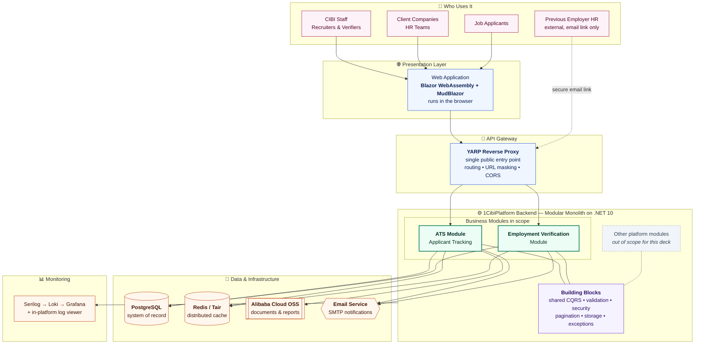
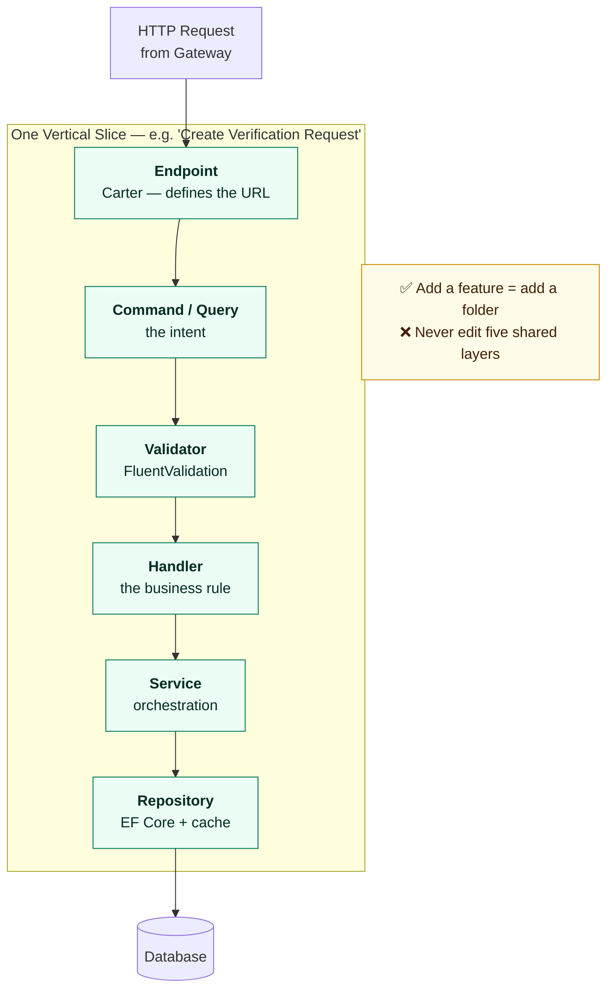
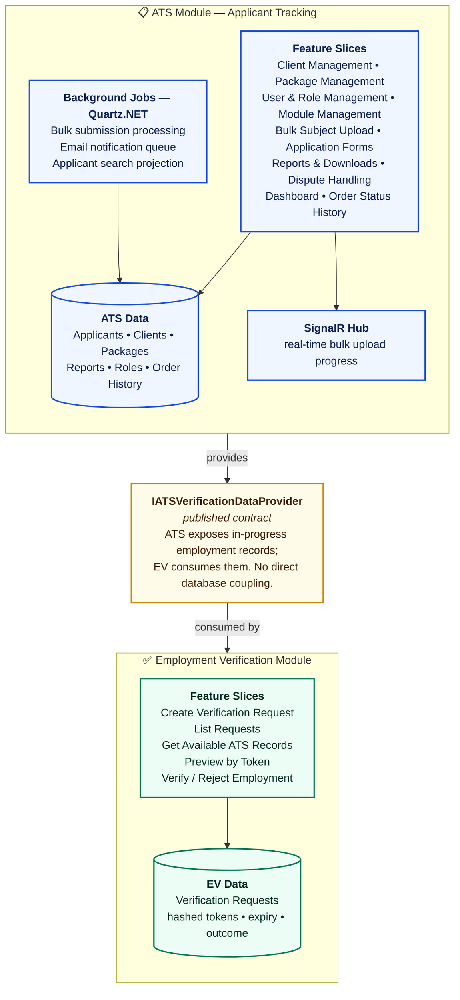
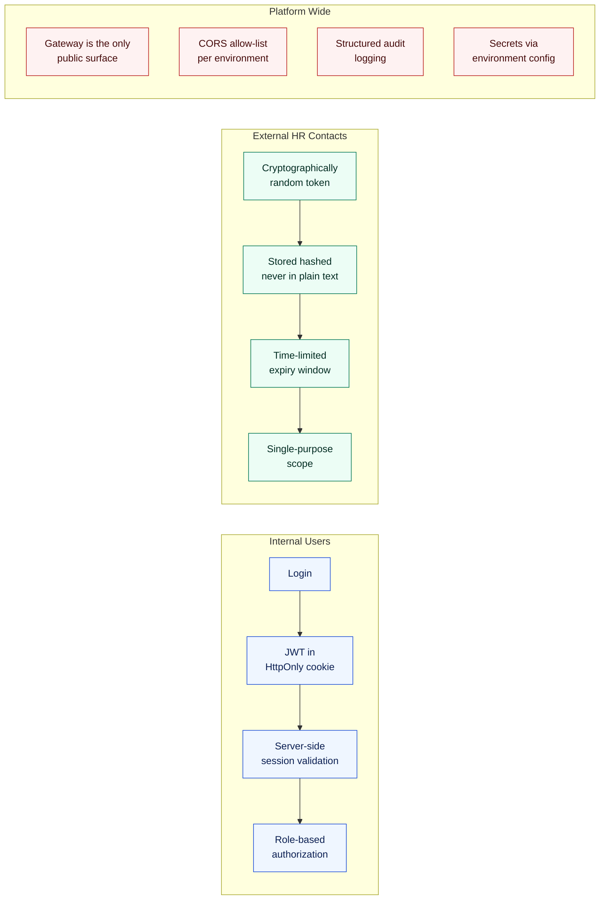
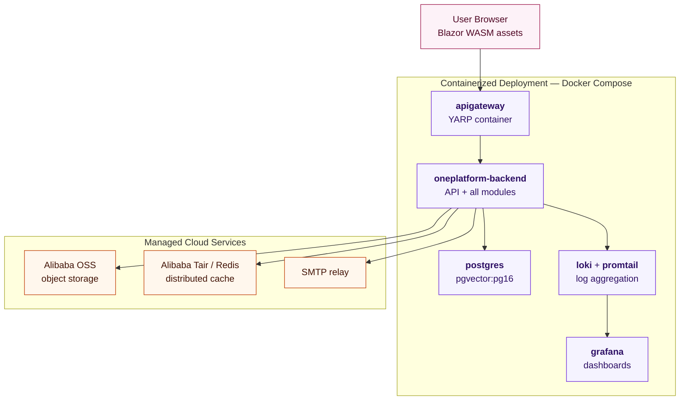

# 1CibiPlatform — Architecture Overview

**Audience:** management / stakeholders
**Scope of this document:** the two vertical slices in focus — **ATS** (Applicant Tracking System) and **Employment Verification**. Other modules exist on the same platform but are intentionally left out here.

---

## 1. The Big Picture

One platform, one deployable backend, many independent business modules.



**Why this shape matters commercially**

| Decision | Business benefit |
| --- | --- |
| **Modular monolith** — modules are isolated, but ship as one unit | Microservice-style team autonomy, without microservice hosting cost or operational complexity |
| **Vertical slices** — each feature owns its full stack | New features are added *beside* existing code, not *inside* it — low regression risk |
| **API Gateway in front** | Internal structure is never exposed publicly; routes can change without breaking clients |
| **Shared Building Blocks** | Security, validation, and logging are written once and enforced everywhere |

---

## 2. Technology Stack

```mermaid
flowchart LR
    subgraph FE["Frontend"]
        F1["Blazor WebAssembly"]
        F2["MudBlazor<br/>Material design components"]
        F3["SignalR client<br/>live progress updates"]
    end

    subgraph API["Backend — .NET 10"]
        B1["Carter<br/>Minimal API endpoints"]
        B2["MediatR<br/>CQRS mediator"]
        B3["FluentValidation"]
        B4["Mapster<br/>object mapping"]
        B5["EF Core<br/>data access"]
        B6["Quartz.NET<br/>background jobs"]
        B7["Serilog<br/>structured logging"]
    end

    subgraph SEC["Security"]
        S1["JWT Bearer tokens<br/>HttpOnly cookies"]
        S2["SAML2 SSO"]
        S3["Hashed, expiring<br/>verification tokens"]
    end

    subgraph OPS["Platform &amp; Ops"]
        O1["Docker &amp; Docker Compose"]
        O2["PostgreSQL 16 + pgvector"]
        O3["Redis / Alibaba Tair"]
        O4["Alibaba Cloud OSS"]
        O5["Grafana + Loki"]
        O6["GitHub Actions CI"]
    end

    FE --> API --> OPS
    API --- SEC

    classDef fe fill:#EFF6FF,stroke:#1D4ED8,color:#0B1F52
    classDef be fill:#F5F3FF,stroke:#6D28D9,color:#2E1065
    classDef sec fill:#FEF2F2,stroke:#B91C1C,color:#450A0A
    classDef ops fill:#FFF7ED,stroke:#C2410C,color:#431407
    class F1,F2,F3 fe
    class B1,B2,B3,B4,B5,B6,B7 be
    class S1,S2,S3 sec
    class O1,O2,O3,O4,O5,O6 ops
```



---

## 3. What a "Vertical Slice" Means

Traditional layered systems split code by *technical layer*. We split by *business capability*. Each feature is a self-contained slice — request, validation, business rule, and data access all in one place.



---

## 4. Module Deep Dive — ATS &amp; Employment Verification



> **Key architectural point for leadership:** Employment Verification does **not** reach into the ATS database. It talks to ATS through a published contract. Either module can be reworked, re-platformed, or extracted into its own service without touching the other.

---

## 5. End-to-End Business Flow — Employment Verification

This is the flow a stakeholder can follow without any technical background.

```mermaid
sequenceDiagram
    autonumber
    actor V as CIBI Verifier
    participant UI as Web App<br/>Blazor
    participant GW as API Gateway<br/>YARP
    participant EV as Employment<br/>Verification Module
    participant ATS as ATS Module
    participant DB as PostgreSQL
    participant ML as Email Service
    actor HR as Previous Employer HR

    V->>UI: Open Employment Verification
    UI->>GW: Request candidates awaiting verification
    GW->>EV: Route to module
    EV->>ATS: Get in-progress employment records<br/>via published contract
    ATS->>DB: Query applicant records
    DB-->>ATS: Records
    ATS-->>EV: Candidate list
    EV-->>UI: Display candidates

    V->>UI: Select candidate, send request
    UI->>GW: Create verification request
    GW->>EV: Route to module
    EV->>EV: Generate secure token<br/>hashed, time-limited
    EV->>DB: Save request
    EV->>ML: Send branded verification email
    ML-->>HR: Secure one-time link

    HR->>GW: Open link — no login required
    GW->>EV: Preview request by token
    EV->>DB: Validate token &amp; expiry
    DB-->>EV: Request details
    EV-->>HR: Show verification form

    HR->>GW: Confirm or Reject employment
    GW->>EV: Record outcome
    EV->>DB: Persist result &amp; timestamp
    EV-->>HR: Confirmation

    Note over V,DB: Verifier sees the updated status<br/>on the dashboard
```

**Business value delivered by this flow**

- Employment checks that were manual phone calls and email chasing are now a tracked, auditable, self-service workflow.
- The external HR contact needs **no account** — one secure, expiring, single-purpose link.
- Every request has a timestamped audit trail: who requested, who responded, when, and what the outcome was.

---

## 6. Security Model



---

## 7. Deployment Topology



---

## 8. Summary for Leadership

| Question | Answer |
| --- | --- |
| **How fast can we add a new business module?** | Modules are self-contained. A new one plugs into registration, gateway routing, and shared building blocks — no rewrite of existing modules. |
| **What is the blast radius of a change?** | A vertical slice. Changing one feature does not touch shared layers used by other features. |
| **Can we scale?** | Yes — the gateway allows multiple backend instances, cache and storage are already externalized, and any module can be extracted into its own service later because integration is contract-based. |
| **Is it observable?** | Every request is structured-logged through Serilog, shipped to Loki, and visualised in Grafana, with an in-platform log viewer for support staff. |
| **What is the operational cost profile?** | One deployable backend instead of N microservices — significantly lower hosting, networking, and DevOps overhead at this stage of growth. |
